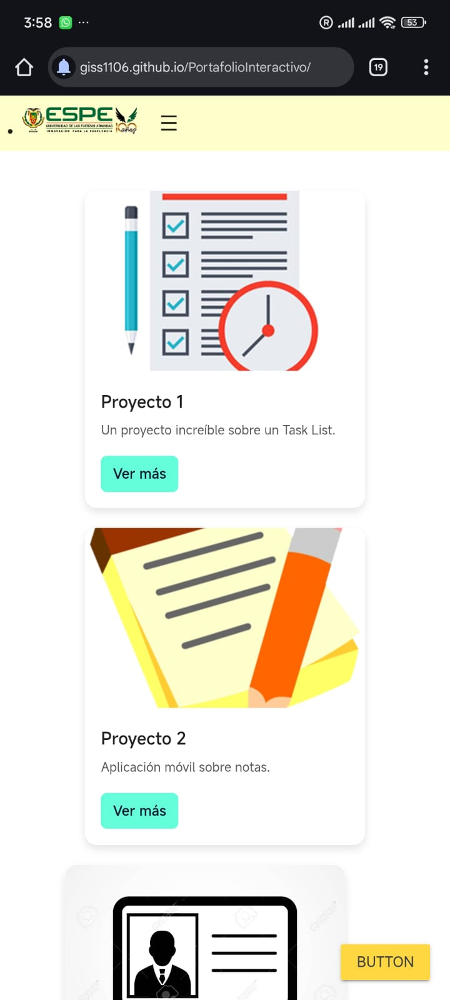

# Portafolio Interactivo

Aplicación web progresiva (PWA) que permite mostrar proyectos de manera dinámica, con la opción de instalarlos como aplicación en dispositivos móviles.

## Propósito
El objetivo de Portafolio Interactivo PWA es ofrecer a los usuarios una forma sencilla de explorar proyectos y administrarlos, con características como:

- Interfaz clara y moderna, fácil de navegar.
- Menú móvil desplegable y accesible desde cualquier dispositivo.
- Posibilidad de instalar la aplicación como PWA.
- Guardado de proyectos en localStorage para persistencia sin servidor.

---

## Instalación en dispositivos móviles
2. Abre la aplicación en el navegador de tu celular.
3. Despliega el menú móvil (☰).
4. Pulsa el botón "Instalar App".
5. La app se instalará como una aplicación nativa y podrá usarse offline.*.

---

## Estructura del proyecto
```
src/
├── components/         # Componentes Web personalizados
│   ├── portfolio-product-card.js
│   └── portfolio-footer.js
│   └── portfolio-navbar.js
├── css/                # Estilos
│   └── app.css
├── images/             # Imágenes de recetas
│   └── docs/           # Captura de pantalla 
│   └── icons/          # Iconos para PWA
├── app.js              # Lógica principal
├── index.html          # Página principal
├── manifest.webmanifest
└── sw.js               # Service Worker
```

---

## Capturas de pantalla

| Pantalla en el  github pages|instalacion de app | Notificaciones |Pagina Principal app instalada |
|--------------------|-----------------|-----------------|
|  |  |  |  |

---